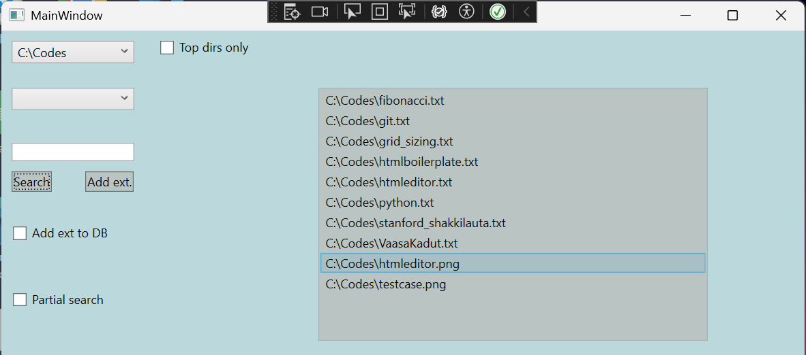

Project keywords: C#, WPF, File processing

ABOUT THE APP

The idea of ​​the application is to make file processing and management easier. Currently, the app has limited features as it is in its early stages of development. Current features are listed and explained below.

AUTOMATIC SEARCH FOR FOLDERS FROM DRIVE C

When the application is launched, the listDirectories function is called. This function collects all the root directories of the C drive using the C# Directory.GetDirectories method. The found directories are stored in a list and displayed in a ComboBox element in the UI, from which the user can select a folder.

FILE SEARCH

The user can search for files in a selected folder based on one or more file extensions. The user can choose whether to extend the search to subfolders or only to the parent folder using the CheckBox elements in the UI. Below is an example image where the user has retrieved only .txt and 
.png files from the C:\codes folder. The result is displayed in a WPF listbox element.

USING FOUND FILES

Since the found files are displayed in a listBox element, the user can access them. Double-clicking on a file opens it using the C# Process.Start method. By right-clicking the mouse, the user can delete the selected file using the C# File.Delete method. Before deleting, the application displays a MessageBox element with yes/no buttons for the user to confirm the deletion or cancel the delete operation.

